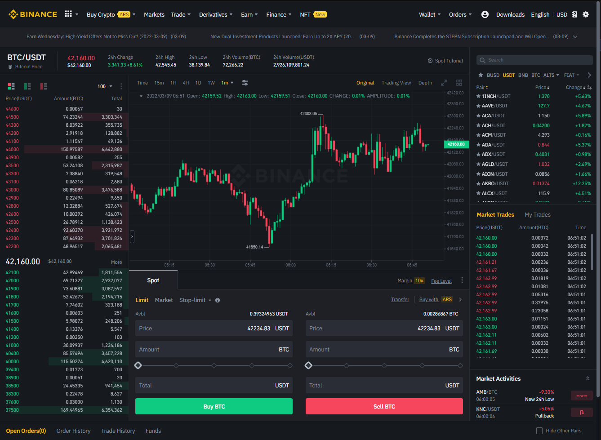
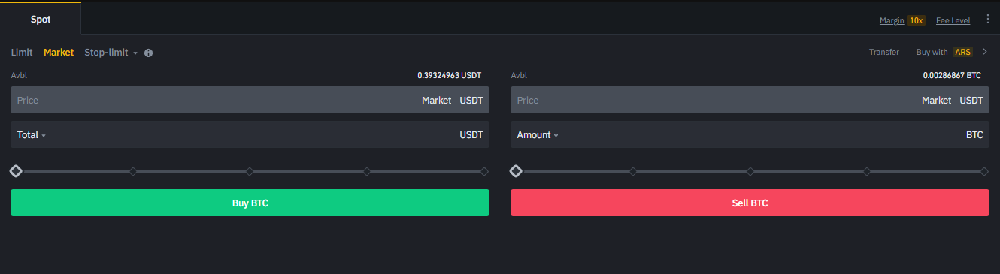

# Binance-Trade-Zen

- [Binance trading](https://github.com/juancarlospaco/binance#binance) simplified, just the trading form, hide all the clutter.

# Before

# After

# Why

I can not find a working web browser extension that simplifies [Binance trading](https://github.com/juancarlospaco/binance#binance) UI,
I just need the trading form, [I do the technical analisys in TradinView](https://github.com/juancarlospaco/tradingview#tradingview),
like lots of people do, so I do not really need the limited [Binance trading](https://github.com/juancarlospaco/binance#binance) charts,
this web browser extensions simplifies [Binance trading](https://github.com/juancarlospaco/binance#binance) to just the trading form.

# More

- See also https://github.com/juancarlospaco/binance#binance
- See also https://github.com/juancarlospaco/cloudbet#cloudbet

# Stars

